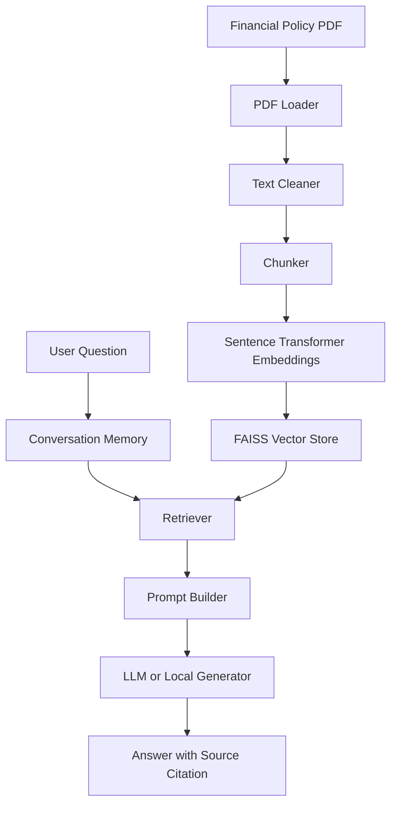

# Financial Policy Chatbot

A modular AI chatbot for answering questions about a financial policy document. The project was refactored from a notebook prototype into a standard Python application with separate ingestion, embeddings, retrieval, memory, and chatbot layers.

## Project Overview

The chatbot reads a financial policy PDF, cleans and chunks the text, stores embeddings in FAISS, and answers user questions with citations to the source section and chunk.

If an OpenAI API key is available, the project can use OpenAI for answer generation. Otherwise it falls back to a local Hugging Face model, and then to an extractive fallback if no generation backend is available.

## Architecture



## Folder Structure

- `data/` contains the source policy PDF.
- `docs/` contains project notes and descriptions.
- `src/ingestion/` handles PDF loading, cleaning, and chunking.
- `src/embeddings/` handles embedding models and the FAISS vector store.
- `src/retrieval/` provides semantic search over stored chunks.
- `src/memory/` stores conversation state for follow-up questions.
- `src/chatbot/` builds prompts and answer generation.
- `src/main.py` runs indexing or an interactive chatbot loop.
- `tests/` contains unit tests for chunking, retrieval, and memory.

## Installation

1. Create and activate a Python 3.11+ environment.
2. Install dependencies:

```bash
pip install -r requirements.txt
```

3. Place the PDF at `data/financial_policy.pdf`.
4. Add environment variables in `.env` if you want OpenAI generation.

## Running Locally

Build the FAISS index:

```bash
python -m src.main build-index
```

Start the interactive chatbot:

```bash
python -m src.main chat
```

## Example Queries

- What are the financial objectives?
- What about debt?
- How does the policy treat taxation?
- What does it say about infrastructure and capital works?
- Summarize the superannuation objective.

## Answer Format

Each response is designed to include:

- a concise answer
- supporting context from the retrieved chunk(s)
- a source line such as `Source: Maintain Low Levels of Debt | Page 7 | Chunk p007_c000`

## Screenshots

Add application screenshots here after running the chatbot locally.

## Notebook Migration

The notebook prototype has been replaced by reusable modules so the business logic is no longer embedded in a Jupyter notebook. The notebook artifact should be removed once you have verified the project files.

## Future Improvements

- Add a small web UI.
- Improve section-title inference during ingestion.
- Add richer answer reranking and citation aggregation.
- Add automated evaluation for retrieval quality.
